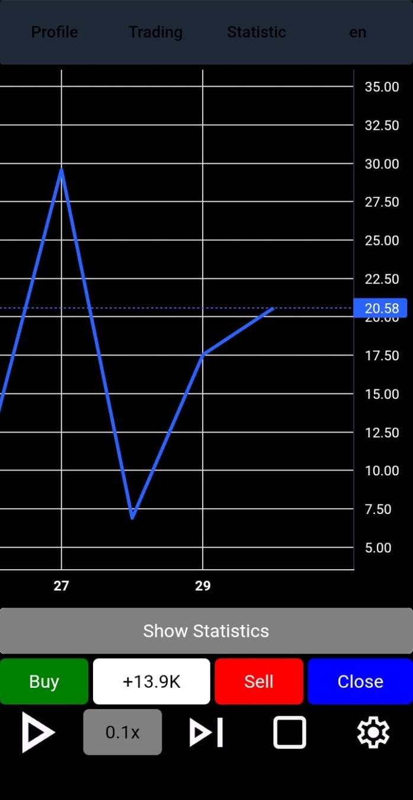

# T-factory

A Next.js-based trading/statistics web application.

## Features

- Multi-language support (English/Russian) via [`public/words.json`](T-factory/public/words.json)
- Trading frame with buy/sell/close actions
- Statistics and profile panels
- Responsive UI with Tailwind CSS
- AWS DynamoDB integration
- Telegram Apps SDK integration

## Getting Started

### Prerequisites

- Node.js (v18+ recommended)
- npm

### Installation

Run the following command in the project root:

./install.bat

### Environment Variables

Create a `.env` file in the project root to store sensitive configuration values. Example variables:

NEXT_PUBLIC_AWS_REGION=region
NEXT_PUBLIC_AWS_ACCESS_KEY_ID=your_aws_access_key
NEXT_PUBLIC_AWS_SECRET_ACCESS_KEY=your_aws_secret_key

### Project Structure

- `app/` - Main application source code and components
- `public/` - Static assets and translation files
- `_static/` - Build and cache files
- `scripts/` - Utility and setup scripts
- `.env` - Environment variable configuration

Refer to each folder for more details on its contents.
